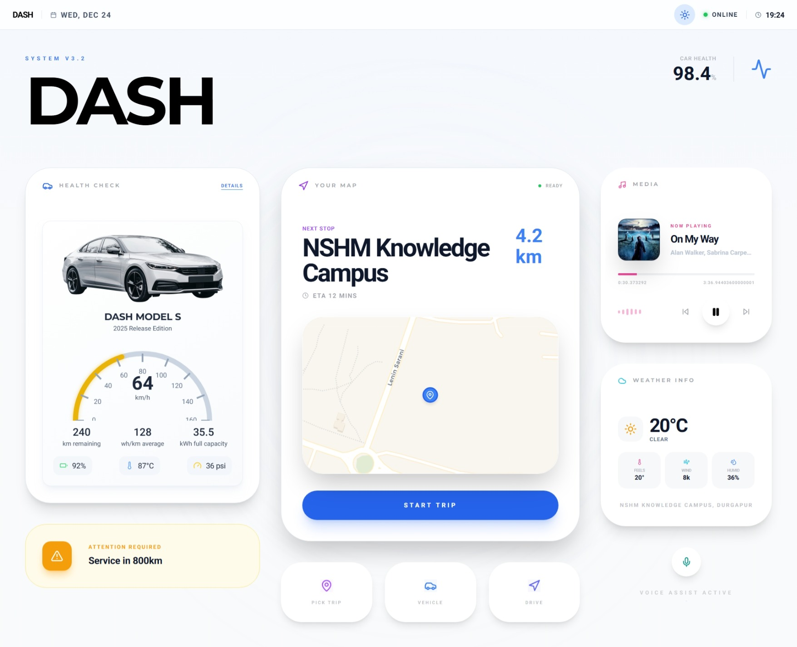

# DASH - Advanced Automotive Interface

DASH is a premium, Tesla-inspired automotive dashboard designed for modern vehicle control systems. Built with Next.js and high-performance animations, it provides a seamless interface for vehicle monitoring, **intelligent voice navigation**, and integrated entertainment.



## ✨ Frontend Features

- 🏎️ **Vehicle Health**: Real-time monitoring of speed, range, tire pressure, and battery levels with premium glassmorphic widgets.
- 🗺️ **Integrated Navigation**: Interactive campus maps (NSHM Knowledge Campus) with multi-stop destination tracking and ETA calculations.
- 🎙️ **AI Voice Navigation**: Advanced hands-free interaction system integrated with the Python backend for intelligent vehicle commands and destination routing.
- ⛅ **Live Weather**: Dynamic weather updates based on the vehicle's current location using WeatherAPI.com.
- 🎵 **Music Hub**: Integrated entertainment controls with a sleek "Now Playing" interface and mini-controller widgets.
- 🌟 **Dynamic Theming**: Premium Light and Dark modes designed for optimal visibility during day and night driving.
- 🚀 **Premium Boot Experience**: Custom animated startup sequence for a high-end vehicle feel.

## 🐍 Backend Voice Engine Features

DASH features a high-accuracy, Python-powered voice recognition engine designed for hands-free vehicle operation.

- **Real-time Audio Processing**: Handles raw audio streams from the dashboard and processes them for command parsing.
- **Natural Language Command Mapping**: Intelligent mapping of human phrases like *"Take me home"* or *"Check my battery"* to dashboard routes.
- **Speech-to-Text Pipeline**: Utilizes Google Web Speech API for near-instant precision in varied acoustic environments.
- **Robust Command Parsing**: 
  - **Navigation**: Recognizes complex destinations (e.g., *"Navigate to ITES Building"*).
  - **Status**: Visualizes car diagnostics via voice (e.g., *"Show vehicle status"*).
  - **Media**: Full voice-driven media controls (e.g., *"Play music"*, *"Next track"*).
- **Multipart Data Handling**: Securely manages high-frequency audio file uploads from the Next.js frontend.

## 🛠️ Tech Stack

### Frontend
- **Framework**: [Next.js 14](https://nextjs.org/) (App Router)
- **Styling**: [Tailwind CSS](https://tailwindcss.com/)
- **Animations**: [Framer Motion](https://www.framer.com/motion/)
- **Icons**: [Lucide React](https://lucide.dev/)
- **Mapping**: [Leaflet](https://leafletjs.org/) & [OSRM](https://project-osrm.org/)

### Backend (Voice Engine)
- **Framework**: [Flask 2.0.1](https://flask.palletsprojects.com/) (Python)
- **Speech Recognition**: [SpeechRecognition](https://pypi.org/project/SpeechRecognition/) (Google Web Speech API)
- **Audio Processing**: [Pydub](https://pydub.com/) & [FFmpeg](https://ffmpeg.org/)
- **Cross-Origin**: [Flask-CORS](https://flask-cors.readthedocs.io/)
- **Production Server**: [Gunicorn](https://gunicorn.org/)

## 🚀 Getting Started

### Prerequisites

- **Node.js**: 18.x or later
- **Python**: 3.9 or later
- **FFmpeg**: Required for audio processing.
  - *Windows*: `choco install ffmpeg`
  - *MacOS*: `brew install ffmpeg`
- **WeatherAPI.com**: A valid API Key for live weather features.

### Installation & Setup

#### 1. Setup Backend (Voice Engine)
```bash
cd backend
python -m venv venv

# On Windows:
venv\Scripts\activate
# On Unix or MacOS:
source venv/bin/activate

pip install -r requirements.txt
python app.py
```
*The backend starts on `http://localhost:5000` by default.*

#### 2. Setup Frontend
```bash
# Return to root directory
npm install
```

#### 3. Configure Environment Variables
Create a `.env.local` file in the root directory:
```env
WEATHER_API_KEY=your_api_key_here
NEXT_PUBLIC_API_BASE_URL=http://localhost:5000
```

#### 4. Run Frontend
```bash
npm run dev
```

## 🎙️ Supported Voice Commands

The Voice Assistant simplifies interaction with the dashboard:
- **Navigation**: *"Navigate to Gate 1"*, *"Go to Admin"*, *"Take me to ITES Building"*
- **Status**: *"Show vehicle status"*, *"Check car health"*, *"Diagnostics"*
- **Media**: *"Play music"*, *"Next track"*, *"Stop music"*, *"Open music player"*
- **Home**: *"Go home"*, *"Dashboard"*

## 📁 Project Structure

- `app/`: Next.js pages and layouts (Routes: `/`, `/car-conditions`, `/destination`, `/navigation`, `/music`)
- `backend/`: Flask server for voice processing and command logic
- `components/`: Premium UI components (Tesla-style widgets, Map, Breadcrumbs, Voice Controller)
- `lib/`: Core logic, theme context, music state management, and API integrations
- `public/`: Static assets (maps, car assets, icons, logos)
- `styles/`: Global CSS and Tailwind configurations


